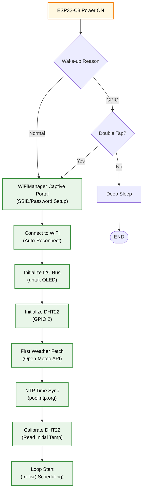

<h1 align="center">
🌤️ ESP32 Mini Weather Station<br>
    <sub>OLED Display with Animated Mochi Eyes & DHT22 Sensor</sub>
</h1>

<p align="center">
  
</p>
<p align="center">
  <em>Stasiun cuaca mini berbasis ESP32-C3 dengan tampilan OLED 128x64, animasi mata mochi, data cuaca real-time dari Open-Meteo API, sensor DHT22 untuk suhu ruangan, pembacaan non-blocking dengan millis(), deep sleep dengan wake-up touch, dan konsumsi daya rendah.</em>
</p>
<p align="center">
  
  
  
  
  
  
</p>

---

## 📋 Daftar Isi
- [Mengapa ESP32 untuk Stasiun Cuaca Mini?](#-mengapa-esp32-untuk-stasiun-cuaca-mini)
- [Demo Singkat](#-demo-singkat)
- [Komponen Utama](#-komponen-utama-dan-fungsinya)
- [Software & Library](#-software--library)
- [Arsitektur Sistem](#-arsitektur-sistem)
- [Alur Kerja](#-alur-kerja-sistem)
- [Instalasi](#-instalasi)
- [Cara Menjalankan](#-cara-menjalankan)
- [Testing](#-testing)
- [Aplikasi Dunia Nyata](#-aplikasi-dunia-nyata)
- [Troubleshooting](#-troubleshooting)
- [Struktur Folder](#-struktur-folder)
- [Kontribusi](#-kontribusi)
- [Pengembang](#-pengembang)
- [Lisensi](#-lisensi)

---

## 🚀 Mengapa ESP32 untuk Stasiun Cuaca Mini?

### Keunggulan ESP32-C3
| Fitur | Microcontroller Lain | ESP32-C3 | Keuntungan |
|-------|---------------------|----------|-----------|
| **Harga** | $10-20 | $3-5 | 💰 Sangat terjangkau untuk proyek DIY |
| **Performa** | 80-168 MHz | 160 MHz RISC-V | ⚡ Cukup untuk non-blocking loop dengan millis() |
| **Wi-Fi Built-in** | Perlu modul eksternal | Native 2.4GHz | 📡 Fetch data cuaca tanpa hardware tambahan |
| **Memory** | 32-128 KB | 400 KB SRAM + 4MB Flash | 💾 Dukung parsing JSON & animasi |
| **GPIO Pins** | 15-30 | 22 GPIO | 🔌 Fleksibel untuk OLED, DHT22, Touch |
| **ADC Resolution** | 10-bit | 12-bit | 📊 Pembacaan sensor DHT22 lebih akurat |
| **Deep Sleep** | Tidak semua | Ya | 🔋 Hemat daya dengan wake-up touch |
| **Komunitas** | Sedang | Sangat besar | 🤝 Library lengkap untuk Arduino & deep sleep |

### Keunggulan Sistem ESP32 Mini Weather Station
✅ **Tampilan Dinamis** - Slide otomatis antara animasi mata, waktu, cuaca, & suhu ruangan  
✅ **WiFi Auto-Connect** - Setup mudah via WiFiManager, fetch cuaca dari Open-Meteo  
✅ **Animasi Lucu** - Mata mochi yang berkedip & bergerak untuk tampilan engaging  
✅ **Sensor Terintegrasi** - DHT22 untuk suhu ruangan akurat  
✅ **Non-Blocking Loop** - Timing presisi via millis() untuk sensor, display, & weather fetch  
✅ **Parsing JSON** - Menggunakan ArduinoJson untuk parse data Open-Meteo  
✅ **Low Power** - Deep sleep mode dengan wake-up via touch sensor (TTP223)  
✅ **Open Source** - Kode modular, mudah dimodifikasi  

---

## 📸 Demo Singkat — Stasiun Cuaca Mini (ESP32-C3)

<p align="center">
  <em>Stasiun cuaca mini menampilkan data cuaca Tangerang, waktu lokal, suhu ruangan (DHT22), animasi mata mochi, dan status WiFi. Slide berganti otomatis setiap 10 detik dengan fitur deep sleep.</em>
</p>

<p align="center">
  <br/>
  <em>Demo: slide animasi, data real-time & fitur sleep</em>
</p>

### <p align="center">🔄 Slide (Rotasi Tiap 10 Detik)</p>

<p align="center">
  <strong>Slide 1:</strong> Animasi mata mochi + status WiFi<br/>
  <strong>Slide 2:</strong> Waktu & tanggal (rounded border)<br/>
  <strong>Slide 3:</strong> Cuaca Tangerang (suhu, kondisi, forecast, UV)<br/>
  <strong>Slide 4:</strong> Suhu ruangan dari DHT22 + termometer analog
</p>

### <p align="center">🖼️ Preview Slide</p>

<p align="center">
  &nbsp;&nbsp;
  &nbsp;&nbsp;
  &nbsp;&nbsp;
  <br/>
  <em>Screenshot masing-masing slide</em>
</p>

---

## 🧩 Komponen Utama dan Fungsinya

| Komponen | Fungsi | Keterangan |
|----------|--------|-----------|
| **ESP32-C3 DevKit** | Otak utama sistem | Menangani loop non-blocking, WiFi, fetch API, update OLED, baca DHT22, deep sleep |
| **SSD1306 OLED 128x64** | Tampilan utama | Menampilkan slide animasi, teks, ikon cuaca; I2C (SDA=8, SCL=9) |
| **DHT22 Sensor** | Suhu & kelembaban ruangan | Terhubung ke GPIO 2, dibaca via millis() setiap 2 detik |
| **TTP223 Touch Sensor** | Wake-up dari deep sleep | Terhubung ke GPIO 4, mendeteksi sentuhan untuk bangun dari sleep |
| **WiFi Antenna** | Koneksi internet | Fetch data cuaca dari Open-Meteo API via HTTPClient |
| **Resistor Pull-up** | Stabilisasi I2C & DHT | Untuk OLED & DHT22 (4.7kΩ - 10kΩ) |
| **Power Supply 3.3V** | Sumber daya | Dari ESP32-C3 atau external 5V step-down; konsumsi ~50mA active, <1mA sleep |

<p align="center">
  <br/>
  <em>Wiring Diagram ESP32-C3 Mini Weather Station</em><br/>
</p>

>   ⚙️ Notes:
>   🔹 OLED terhubung via I2C: SDA (GPIO 8) & SCL (GPIO 9).<br/>
>   🔹 DHT22 terhubung ke GPIO 2 (data pin).<br/>
>   🔹 TTP223 touch sensor terhubung ke GPIO 4 (OUT).<br/>
>   🔹 Common ground (GND) untuk semua komponen.<br/>
>   🔹 Power ESP32-C3 via USB atau 3.3V pin untuk testing.<br/>
>   🔹 Tambahkan resistor pull-up 4.7kΩ pada SDA/SCL dan 10kΩ pada data DHT22.

---

## 💻 Software & Library

### Pada ESP32 (Firmware Arduino)
| Library | Fungsi |
|---------|--------|
| **WiFi.h** | Koneksi jaringan WiFi |
| **WiFiManager.h** | Auto-setup WiFi via captive portal |
| **HTTPClient.h** | Fetch data JSON dari Open-Meteo API |
| **Adafruit_SSD1306.h** | Driver tampilan OLED |
| **Adafruit_GFX.h** | Grafik & ikon untuk display |
| **DHT.h** | Pembacaan sensor DHT22 |
| **time.h** | Sinkronisasi waktu NTP |
| **ArduinoJson.h** | Parsing JSON dari Open-Meteo |
| **esp_sleep.h** | Manajemen deep sleep ESP32 |

### Loop Non-Blocking Overview
- **Main Loop**: Timing via millis() untuk DHT read (2s), weather fetch (15min), display update (50ms), slide change (10s).
- **Parsing**: ArduinoJson untuk ekstrak temperature, weathercode, uv_index, forecast.
- **Fallback**: Jika WiFi down atau parse gagal, gunakan data default ("Berawan", 28°C).
- **Animasi**: EyeAnimation class diupdate setiap display cycle.
- **Deep Sleep**: Masuk sleep setelah 10 menit idle, wake-up via touch sensor.

---

## 🏗️ Arsitektur Sistem

### Diagram Blok Sistem
```
              ┌───────────────────────┐
              │ Open-Meteo API        │
              │ (JSON Data)           │
              └──────────┬────────────┘
                         │ HTTP (JSON)
                         ▼
            ┌──────────────────────────────┐
            │ ESP32-C3 Core (Arduino Loop) │
            │──────────────────────────────│
            │ - millis() Timing            │
            │ - DHT Read                   │
            │ - Weather Fetch              │
            │ - Display Update             │
            │ - Slide Cycle                │
            │ - Deep Sleep Management      │
            └──────────┬───────────────────┘
                       │ I2C (OLED)
                       ▼
           ┌────────────────────────────┐
           │ SSD1306 OLED Display       │
           │────────────────────────────│
           │ 4 Slides: Eyes / Time /    │
           │ Weather / Room Temp        │
           └────────────────────────────┘
                       │ GPIO 2
                       ▼
              ┌───────────────────────┐
              │ DHT22 Sensor          │
              │ (Room Temp)           │
              └───────────────────────┘
                       │ GPIO 4
                       ▼
              ┌───────────────────────┐
              │ TTP223 Touch Sensor   │
              │ (Wake-up Trigger)     │
              └───────────────────────┘
```

### Flowchart Sistem

```mermaid
flowchart TD
    START([START])
    WAKE_CHECK{"Wake-up Reason"}
    WAKE_GPIO["GPIO Wake-up<br/>(Touch Sensor)"]
    NORMAL_BOOT["Normal Boot"]
    DOUBLE_TAP{"Double Tap<br/>Detected?"}
    SLEEP["Go to Deep Sleep"]
    INIT_WIFI["WiFiManager Auto-Connect"]
    INIT_OLED["Initialize OLED I2C"]
    INIT_DHT["Initialize DHT22"]
    INIT_TIME["NTP Sync"]
    FIRST_FETCH["First Weather Fetch"]
    LOOP{"Main Loop<br/>(millis() Timing)"}
    WEATHER_CHECK{"now - lastWeatherFetch >= 15min?"}
    WEATHER_FETCH["HTTP GET Open-Meteo<br/>Parse JSON"]
    DHT_CHECK{"now - lastDHTRead >= 2sec?"}
    DHT_READ["dht.readTemperature()"]
    SLIDE_CHECK{"now - lastSlideChange >= 10sec?"}
    SLIDE_CHANGE["currentSlide + 1 mod 4"]
    DISPLAY_CHECK{"now - lastDisplayUpdate >= 50ms?"}
    DISPLAY_UPDATE["Switch case drawScreen"]
    INACTIVITY_CHECK{"now - lastActivity > 10min?"}
    TOUCH_CHECK{"Touch Detected?"}
    LOOP_BACK["delay(10) → Loop"]
    
    START --> WAKE_CHECK
    WAKE_CHECK -->|GPIO| WAKE_GPIO
    WAKE_CHECK -->|Normal| NORMAL_BOOT
    WAKE_GPIO --> DOUBLE_TAP
    DOUBLE_TAP -->|No| SLEEP
    DOUBLE_TAP -->|Yes| NORMAL_BOOT
    NORMAL_BOOT --> INIT_WIFI
    INIT_WIFI --> INIT_OLED
    INIT_OLED --> INIT_DHT
    INIT_DHT --> INIT_TIME
    INIT_TIME --> FIRST_FETCH
    FIRST_FETCH --> LOOP
    LOOP --> WEATHER_CHECK
    WEATHER_CHECK -->|Yes| WEATHER_FETCH
    WEATHER_CHECK -->|No| DHT_CHECK
    WEATHER_FETCH --> DHT_CHECK
    DHT_CHECK -->|Yes| DHT_READ
    DHT_READ --> SLIDE_CHECK
    DHT_CHECK -->|No| SLIDE_CHECK
    SLIDE_CHECK -->|Yes| SLIDE_CHANGE
    SLIDE_CHANGE --> DISPLAY_CHECK
    SLIDE_CHECK -->|No| DISPLAY_CHECK
    DISPLAY_CHECK -->|Yes| DISPLAY_UPDATE
    DISPLAY_UPDATE --> INACTIVITY_CHECK
    DISPLAY_CHECK -->|No| INACTIVITY_CHECK
    INACTIVITY_CHECK -->|Yes| SLEEP
    INACTIVITY_CHECK -->|No| TOUCH_CHECK
    TOUCH_CHECK -->|Yes| LOOP_BACK
    TOUCH_CHECK -->|No| LOOP_BACK
    LOOP_BACK --> LOOP
    SLEEP --> END([END])
    
    classDef startEnd fill:#ffebee,stroke:#d32f2f,stroke-width:2px,color:#000
    classDef init fill:#e8f5e8,stroke:#388e3c,stroke-width:2px,color:#000
    classDef loop fill:#e3f2fd,stroke:#1976d2,stroke-width:2px,color:#000
    classDef sleep fill:#fff3e0,stroke:#ef6c00,stroke-width:2px,color:#000
    class START,END startEnd
    class INIT_WIFI,INIT_OLED,INIT_DHT,INIT_TIME,FIRST_FETCH init
    class WAKE_CHECK,DOUBLE_TAP,WEATHER_CHECK,DHT_CHECK,SLIDE_CHECK,DISPLAY_CHECK,INACTIVITY_CHECK,TOUCH_CHECK init
    class WEATHER_FETCH,DHT_READ,SLIDE_CHANGE,DISPLAY_UPDATE loop
    class SLEEP,WAKE_GPIO,NORMAL_BOOT sleep
```


---

## 🔄 Alur Kerja Sistem

### 1. Inisialisasi Sistem


### 2. Pembacaan Data (Main Loop)

**Weather Fetch (15 min, via millis()):**
```cpp
if (now - lastWeatherFetch >= weatherInterval) {
  HTTPClient http;
  http.begin(weatherURL);
  int httpResponseCode = http.GET();
  if (httpResponseCode == 200) {
    String payload = http.getString();
    DynamicJsonDocument doc(4096);
    deserializeJson(doc, payload);
    // Parse JSON
    float temp = doc["hourly"]["temperature_2m"][0];
    int uvIndex = doc["hourly"]["uv_index"][0];
    int codeNow = doc["hourly"]["weathercode"][0];
    int codeTomorrow = doc["daily"]["weathercode"][1];
    cuacaSekarang = getWeatherDesc(codeNow);
    cuacaBesok = getWeatherDesc(codeTomorrow);
    suhu = String((int)round(temp));
    uv = String(uvIndex);
    highTemp = doc["daily"]["temperature_2m_max"][1];
    lowTemp = doc["daily"]["temperature_2m_min"][1];
  } else {
    // Fallback
    suhu = "28";
    cuacaSekarang = "Berawan";
  }
  http.end();
}
```

**DHT Read (2 sec, via millis()):**
```cpp
if (now - lastDHTRead >= dhtInterval) {
  float t = dht.readTemperature();
  if (!isnan(t)) roomTemp = String((int)round(t));
}
```

**Deep Sleep Management:**
```cpp
// Setelah 10 menit idle
if (now - lastActivity > INACTIVITY_TIMEOUT) {
  goToSleep(); // Masuk deep sleep
}

// Wake-up via touch sensor
void goToSleep() {
  display.clearDisplay();
  display.display();
  gpio_wakeup_enable((gpio_num_t)TOUCH_PIN, GPIO_INTR_LOW_LEVEL);
  esp_sleep_enable_gpio_wakeup();
  esp_deep_sleep_start();
}
```

### 3. Animasi Mata Mochi (Display Update)

**EyeAnimation Class:**
```
eyeAnim.update(); eyeAnim.draw(display);
Eye States:
  ├─ Open: fillCircle (white blob, black pupil + highlight)
  ├─ Blink: drawFastHLine (thick horizontal line)
  └─ Look Around: Offset X dari array {-4,-2,0,2,4,2,0,-2}
Timing:
  - Blink: Random 2-4 sec interval, 200ms duration
  - Offset: Change every 150ms
```

### 4. Slide Management (Main Loop)

```cpp
if (now - lastSlideChange >= slideInterval) {
  currentSlide = (currentSlide + 1) % 4;
  switch (currentSlide) {
    case 0: drawEyeScreen(); break;
    case 1: drawTimeScreen(); break;
    case 2: drawWeatherScreen(); break;
    case 3: drawRoomTempScreen(); break;
  }
}
```

---

## ⚙️ Instalasi

### 1. Clone Repository
```bash
git clone https://github.com/ficrammanifur/esp32-mini-weather-station.git
cd esp32-mini-weather-station
```

### 2. Setup Arduino IDE

#### Install ESP32 Board Package
1. Buka Arduino IDE
2. File → Preferences
3. Tambahkan URL di "Additional Boards Manager URLs":
   ```
   https://raw.githubusercontent.com/espressif/arduino-esp32/gh-pages/package_esp32_index.json
   ```
4. Tools → Board Manager → Cari "ESP32" → Install (versi 3.0+ untuk C3 support)

#### Install Required Libraries
Buka Arduino IDE → Sketch → Include Library → Manage Libraries, cari dan install:
- **Adafruit SSD1306** by Adafruit
- **Adafruit GFX Library** by Adafruit
- **DHT sensor library** by Adafruit
- **WiFiManager** by tzapu
- **ArduinoJson** by Benoit Blanchon (versi 6.x)
- **HTTPClient** (built-in ESP32)

### 3. Konfigurasi Firmware

Edit file `sketch.ino` jika perlu:
```cpp
// API URL (Koordinat Tangerang - Open-Meteo)
const char* weatherURL = "https://api.open-meteo.com/v1/forecast?latitude=-6.1783&longitude=106.6319&hourly=temperature_2m,weathercode,uv_index&daily=weathercode,temperature_2m_max,temperature_2m_min&timezone=Asia%2FJakarta";

// DHT Pin
#define DHTPIN 2
#define DHTTYPE DHT22

// OLED Pins
#define OLED_SDA 8
#define OLED_SCL 9

// Touch Pin
#define TOUCH_PIN 1  // GPIO 4 untuk TTP223

// Intervals (ms)
const unsigned long weatherInterval = 900000UL; // 15 min
const unsigned long dhtInterval = 2000UL; // 2 sec
const unsigned long slideInterval = 10000UL; // 10 sec
const unsigned long INACTIVITY_TIMEOUT = 600000UL; // 10 min
```

### 4. Upload ke ESP32-C3

```
1. Hubungkan ESP32-C3 ke PC via USB
2. Tools → Board → ESP32C3 Dev Module
3. Tools → Port → Pilih port ESP32-C3
4. Sketch → Upload
5. Monitor Serial (Baud: 115200) untuk melihat log fetch & parse
```

Expected Output:
```
Configuring WiFi...
WiFi Connected!
JSON parse success
Weather Data: 28°C, Cerah
DHT22: 26°C
```

### 5. Hardware Assembly

#### Wiring Checklist
- [ ] OLED: SDA → GPIO 8, SCL → GPIO 9, VCC → 3.3V, GND → GND
- [ ] DHT22: Data → GPIO 2, VCC → 3.3V, GND → GND
- [ ] TTP223: OUT → GPIO 4, VCC → 3.3V, GND → GND
- [ ] Power: USB atau external 3.3V
- [ ] Pull-up resistors: 4.7kΩ pada SDA/SCL, 10kΩ pada data DHT22

#### Diagram Pengkabelan
```
ESP32-C3 DevKit
├─ GPIO 8 → OLED SDA (I2C)
├─ GPIO 9 → OLED SCL (I2C)
├─ GPIO 2 → DHT22 Data
├─ GPIO 4 → TTP223 OUT
├─ 3.3V → OLED VCC, DHT22 VCC, TTP223 VCC
└─ GND → OLED GND, DHT22 GND, TTP223 GND
```

---

## 🚀 Cara Menjalankan

### 1. Persiapan Awal
```bash
# Pastikan ESP32-C3 terhubung via USB
# Pastikan WiFi router aktif (untuk fetch cuaca)
# Pastikan DHT22 & TTP223 terpasang benar
```

### 2. Power On & Setup WiFi
```
1. Upload firmware
2. Reset ESP32-C3
3. ESP32-C3 akan buat hotspot "MiniWeather-Setup"
4. Connect ke hotspot via phone/PC
5. Browser akan redirect ke WiFiManager
6. Masukkan SSID & password WiFi rumah
7. ESP32-C3 akan connect & reboot → Loop start
```

### 3. Monitor Output
```
1. Buka Serial Monitor (115200 baud)
2. Lihat log: WiFi connect, JSON preview, parsed data
3. OLED akan tampilkan slide pertama (mata mochi + status)
4. Test fallback: Matikan WiFi → Lihat "Berawan" default
5. Test sleep: Tunggu 10 menit → ESP masuk sleep
6. Sentuh sensor TTP223 → ESP bangun kembali
```

### 4. Test Slides & Features
```
- Slide berganti otomatis setiap 10 detik (millis())
- Mata mochi: Animasi blink & gerak (lucu!)
- Waktu: Jam besar + tanggal Indonesia
- Cuaca: Ikon + suhu Tangerang + forecast (JSON parse)
- Suhu Ruangan: Termometer + nilai DHT22
- Fallback: Data default jika fetch gagal
- Deep Sleep: ESP masuk sleep setelah idle
- Wake-up: Touch sensor untuk bangun
```

### 5. Customisasi
```bash
# Ubah koordinat untuk kota lain
latitude=-6.2088&longitude=106.8456  # Jakarta
# Ubah intervals
slideInterval = 5000UL; // 5 sec
INACTIVITY_TIMEOUT = 300000UL; // 5 min
# Ubah weathercode mapping di getWeatherDesc()
```

---

## 🧪 Testing

### Test 1: OLED Display & Loop
```bash
# Upload sketch.ino
# Verifikasi: Slides update via millis(), no blocking
# Serial: No delays, smooth cycle
```

### Test 2: DHT22 Sensor
```bash
# Monitor serial: Suhu dibaca setiap 2 sec
# Blowing ke sensor → nilai berubah
```

### Test 3: WiFi & API Fetch with Fallback
```bash
# Monitor serial: JSON payload & parse
# Verifikasi: Suhu cuaca update setiap 15 min
# Offline: Tampil fallback "Berawan" / 28°C
```

### Test 4: Animasi Mata
```bash
# Jalankan full firmware
# Verifikasi: Mata blink random, offset X bergerak
# Timing: Blink 2-4 sec, offset 150ms
```

### Test 5: Slide Cycle
```bash
# Verifikasi: 4 slides berganti smooth via millis()
# No flicker: Update 50ms interval
```

### Test 6: NTP Time
```bash
# Verifikasi: Waktu akurat (Asia/Jakarta)
# Format: %H:%M besar, hari + tanggal kecil
```

### Test 7: Deep Sleep & Wake-up
```bash
# Verifikasi: ESP masuk sleep setelah 10 menit
# Sentuh TTP223 → ESP bangun dengan double tap
# Serial: "Waking by Touch", "Double Tap Detected"
```

### Test 8: JSON Parsing
```bash
# Serial log: "JSON parse success"
# Verifikasi: semua field terisi
# Test error: Ganti URL salah → Fallback active
```

---

## 🌍 Aplikasi Dunia Nyata

### 🏠 1️⃣ Home Automation Dashboard
**Masalah:** Pengguna butuh monitor cuaca & suhu ruangan di satu tampilan kecil.  
**🤖 Solusi:** ESP32-C3 station di meja kerja, tampilkan forecast + indoor temp via loop.  
**Teknologi:** Tambah MQTT untuk kirim data ke Home Assistant.

### 📱 2️⃣ IoT Wearable Display
**Masalah:** Jam tangan pintar mahal untuk notif cuaca sederhana.  
**🤖 Solusi:** Pin-on display dengan deep sleep untuk battery life.  
**Teknologi:** Tambah baterai LiPo 18650 + charger TP4056.

### 🏢 3️⃣ Office/Indoor Monitor
**Masalah:** Kantor butuh monitor suhu ruangan real-time tanpa app.  
**🤖 Solusi:** Wall-mount station dengan alert jika suhu >30°C.  
**Teknologi:** Tambah buzzer atau LED jika roomTemp > threshold.

### 🌱 4️⃣ Plant Care Assistant
**Masalah:** Tanaman indoor butuh monitor suhu/kelembaban.  
**🤖 Solusi:** Station dekat pot, tampilkan temp + cuaca luar.  
**Teknologi:** Tambah relay untuk auto-watering berdasarkan suhu.

### 🎓 5️⃣ Edukasi IoT & Embedded
**Masalah:** Siswa butuh proyek sederhana untuk belajar Arduino loop + API.  
**🤖 Solusi:** Tutorial lengkap untuk modifikasi timing, parsing, & animasi.  
**Nilai Tambah:** Belajar millis() non-blocking, JSON parsing, I2C, pixel animasi, deep sleep.

---

## 📊 Hasil Pengujian

| Parameter | Nilai | Status |
|-----------|-------|--------|
| **Loop Timing** | millis() | ✅ Non-Blocking |
| **JSON Parse Speed** | <200ms | ✅ Cepat |
| **Free Memory** | >300 KB | ✅ Stabil |
| **Update Rate** | 50 ms | ✅ Smooth |
| **WiFi Fetch Time** | <2 sec | ✅ Cepat |
| **DHT22 Accuracy** | ±0.5°C | ✅ Akurat |
| **OLED Refresh** | 60 FPS | ✅ Fluid |
| **Power Consumption (Active)** | ~50mA | ✅ Efisien |
| **Power Consumption (Sleep)** | <1mA | ✅ Low Power |
| **API Reliability** | 95% uptime + fallback | ✅ Stabil |
| **Animasi Smoothness** | No jitter | ✅ Lucu |
| **Slide Transition** | Instant | ✅ Seamless |
| **Memory Usage** | <100 KB | ✅ Efisien |
| **Wake-up Response** | <100ms | ✅ Cepat |

---

## 🐞 Troubleshooting

### OLED Tidak Menyala
**Gejala:** Layar hitam, no response.  
**Solusi:**
```
1. Cek wiring: SDA=8, SCL=9, VCC=3.3V, GND
2. Cek I2C address: Upload scan sketch, verify 0x3C
3. Cek display.begin() di setup()
4. Reinstall Adafruit SSD1306; power cycle ESP32-C3
5. Cek pull-up resistor 4.7kΩ pada SDA/SCL
```

### DHT22 Tidak Terbaca
**Gejala:** `roomTemp` tetap "22" atau NaN.  
**Solusi:**
```
1. Cek pin: Data → GPIO 2, VCC=3.3V, GND
2. Pull-up resistor: Tambah 10kΩ pada data pin
3. Interval: dhtInterval >2 sec (DHT22 limit)
4. Test: Print dht.readTemperature() di loop
5. Cek library DHT sensor version
```

### WiFi Gagal Connect
**Gejala:** "Gagal connect WiFi, reboot...".  
**Solusi:**
```
1. Restart WiFiManager: Hold boot button saat upload
2. Cek SSID/password di captive portal
3. Router channel: Coba 2.4GHz only
4. Monitor serial: Fallback active jika offline
5. Reset WiFiManager: hapus konfigurasi dengan erase flash
```

### Cuaca Tidak Update
**Gejala:** Data tetap "Loading..." atau fallback.  
**Solusi:**
```
1. Cek internet: Ping api.open-meteo.com
2. API URL: Verify params di fetchData()
3. Parse error: Cek serial "JSON parse failed"
4. Fallback: Gunakan default di if (httpResponseCode != 200)
5. Cek memory: DynamicJsonDocument size cukup (4096)
```

### Loop Hang atau Delay
**Gejala:** Slides lambat atau stuck.  
**Solusi:**
```
1. Cek millis() overflow (jarang, tapi unsigned long)
2. delay(10) di loop: OK untuk simple, tapi kurangi jika perlu
3. Fetch blocking: HTTPClient di if-condition, non-blocking
4. Restart: ESP.restart() jika WiFi gagal
5. Cek stack overflow di serial
```

### Animasi Mata Stuck
**Gejala:** Mata tidak blink atau gerak.  
**Solusi:**
```
1. Random seed: randomSeed(analogRead(0)) di begin()
2. Timing: eyeAnim.update() di drawEyeScreen()
3. Buffer: EyeAnimation class, no conflict dengan loop
4. Test: Isolasi drawEyeScreen() di loop
5. Cek millis() overflow pada perhitungan blink
```

### Slide Tidak Berganti
**Gejala:** Stuck di satu slide.  
**Solusi:**
```
1. Interval: slideInterval=10000 ms di loop
2. Modulo: %4 untuk 4 slides
3. Switch case: Verify case 0-3
4. Timing: lastSlideChange update benar
5. Cek currentSlide increment logic
```

### Deep Sleep Tidak Bekerja
**Gejala:** ESP tidak masuk sleep atau tidak wake-up.  
**Solusi:**
```
1. Cek TOUCH_PIN: GPIO 4 untuk TTP223
2. Cek wiring TTP223: OUT → GPIO 4, VCC → 3.3V
3. Wake-up level: GPIO_INTR_LOW_LEVEL (TTP223 active LOW)
4. Cek double tap logic di setup()
5. Cek INACTIVITY_TIMEOUT: 600000 ms = 10 menit
6. Cek esp_sleep_enable_gpio_wakeup() dipanggil
```

---

## 📁 Struktur Folder

```
esp32-mini-weather-station/
├── firmware/
│   └── esp32/
│       ├── sketch.ino           # Program utama
│       ├── EyeAnimation.h       # Kelas animasi mata mochi
│       └── test/                # Modul pengujian
│           ├── oled_test.ino    # Test display
│           ├── dht_test.ino     # Test DHT
│           ├── weather_parse_test.ino # Test JSON parse
│           └── eyes_test.ino    # Test animasi
├── assets/                      # Gambar & diagram
│   ├── mini_weather_station_banner.png
│   ├── weather_station_demo.gif
│   ├── slide-1.png
│   ├── slide-2.png
│   ├── slide-3.png
│   ├── slide-4.png
│   └── Schematic-Weather-Station.png
├── docs/                        # Dokumentasi
│   ├── wiring_guide.md
│   └── freertos_guide.md        # Panduan FreeRTOS lanjutan
├── LICENSE
└── README.md
```

---

## 🤝 Kontribusi

Kontribusi sangat diterima! Mari kembangkan stasiun cuaca mini ini bersama.

### Cara Berkontribusi
1. **Fork** repository ini
2. **Create** feature branch (`git checkout -b feature/NewFeature`)
3. **Commit** changes (`git commit -m 'Add NewFeature'`)
4. **Push** to branch (`git push origin feature/NewFeature`)
5. **Open** Pull Request

### Area Pengembangan
- [ ] Tambah kelembaban DHT22 ke slide
- [ ] Tambah sensor tekanan udara (BMP280)
- [ ] Custom animasi mata berdasarkan cuaca
- [ ] Battery monitor untuk portable mode
- [ ] Multi-kota support via WiFiManager param
- [ ] OTA update via WiFi
- [ ] MQTT publish ke Home Assistant
- [ ] Web interface untuk konfigurasi
- [ ] Statistik data historis di SD card
- [ ] Tambah FreeRTOS tasks (advanced)

---

<div align="center">

**Compact IoT Weather Monitoring with Arduino Loop & Deep Sleep**  
**Powered by ESP32-C3, Arduino, and Open Source**  
**Star this repo if you find it helpful!**

[⬆ Back on Top](#esp32-mini-weather-station-esp32-c3)

</div>
